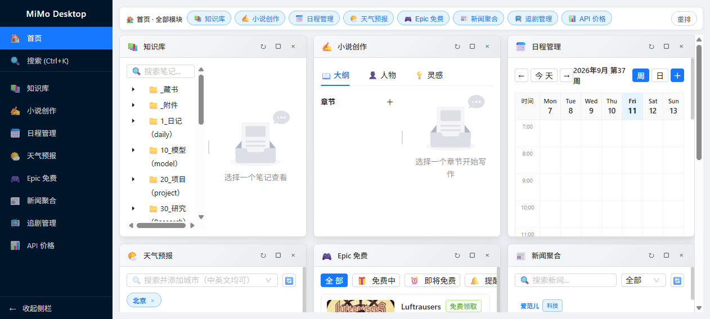
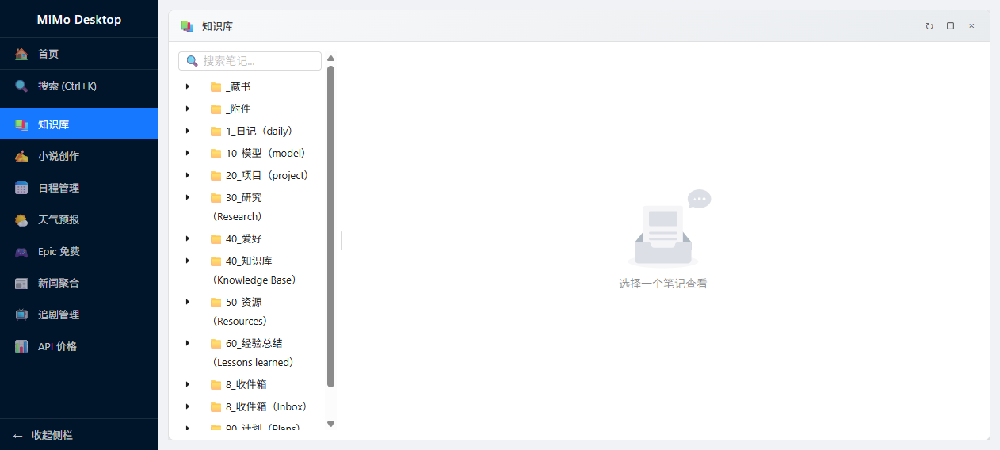
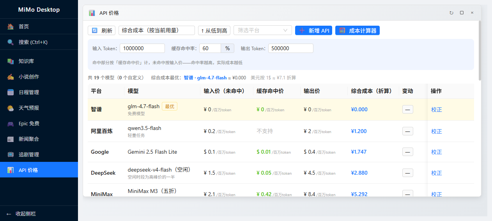
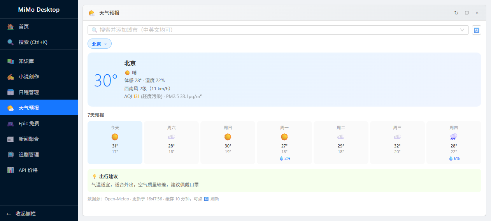

<div align="center">

# 宇界工作台 · YuJie Workbench

**一站式个人效率工作台 —— 知识管理 · 小说创作 · 信息聚合 · 日程规划，一个桌面应用全搞定**

Electron · React · Ant Design · 本地优先 · 免密钥开箱即用

[English](#english) | [简体中文](#简体中文)



</div>

---

<a id="english"></a>
## English

YuJie Workbench is a **local-first personal workbench** for Windows, built with Electron + React. Nine practical modules live in one app behind a free-form, snapping window layout, and an embedded Express server lets you open the very same workbench in a browser (e.g. from your phone on LAN).

| Module | Highlights |
|---|---|
| 📚 Knowledge Base | Mount your local **Obsidian vault**: note tree, full-text search, tags, `[[wikilink]]` & backlinks |
| ✍️ Novel Studio | Chapter tree with drag-sort, character profiles, idea inbox, world docs, relationship graph |
| 📊 LLM API Price Monitor | 19+ models (DeepSeek / Kimi / Qwen / GLM / MiniMax / Claude / OpenAI / Gemini…), dedicated **cache-hit price** column, cost calculator with cache-hit rate, CNY/USD conversion |
| 🎮 Epic Free Games | Current & upcoming free titles, one-click store page, desktop reminder |
| 📅 Calendar | Month / week / day views, **Chinese lunar calendar** (festivals, solar terms, ganzhi), holiday countdown, optional Feishu calendar sync |
| 🌤️ Weather | Multi-city, 7-day forecast, AQI, clothing/umbrella advice — powered by **Open-Meteo, no API key** |
| 📺 TV Tracker | Watchlist, episode progress, ratings & notes |
| 📰 News | Multi-source RSS aggregation, keyword filter, read-later |
| 🧠 Info Hub | Aggregated info cards with scheduled refresh |

### Quick Start

```bash
# Requirements: Windows 10/11, Node.js >= 18, pnpm (or npm)
pnpm install            # or simply double-click scripts\setup.bat
pnpm dev:electron       # desktop app with hot reload
pnpm dev:web            # browser only -> http://localhost:5173
pnpm run build          # production build
pnpm run dist           # portable package -> release/win-unpacked (copy the folder anywhere & run)
pnpm run dist:nsis      # NSIS installer
```

Configuration lives in `.env` (copy `.env.example`); everything works **without any API key** — Feishu calendar is the only opt-in integration that needs your own Feishu app credentials.

---

## 简体中文

### 这是什么

宇界工作台是一个**本地优先**的个人效率中心：知识库、小说创作、LLM API 价格监控、Epic 免费游戏、日程管理（农历/节气）、天气预报、追剧、新闻聚合等模块集成在一个窗口里，支持自由拖拽的窗口式布局；内置 Express 服务器，局域网内浏览器可远程访问同一份数据。

- 🧩 **九大模块**，随时开关，各模块可独占全屏
- 🪟 **自由窗口布局**：拖拽吸附对齐（带参考线）、8 方向缩放、最大化、界面 80%~160% 七档缩放
- 🖥️ **桌面 + 浏览器双端**：Electron 桌面应用与浏览器访问同一后端
- 🔌 **本地优先**：数据保存在本地 `data/` 目录，不经任何第三方服务器
- 🚫 **零密钥起步**：天气使用 Open-Meteo 免注册免密钥；不配置 `.env` 即可运行（飞书日历为可选功能）

### 模块一览

| 模块 | 亮点 | 数据源 |
|---|---|---|
| 📚 知识库 | 挂载本地 Obsidian vault：笔记树、全文搜索、标签、`[[wikilink]]` 双链与反向链接 | 本地 Markdown |
| ✍️ 小说创作 | 章节大纲（拖拽排序）、人物档案、灵感速记、世界观文档、人物关系图 | 本地 JSON |
| 📊 API 价格 | 19+ 模型参考价、**缓存命中价独立成列**、成本计算器（含缓存命中率）、最优价高亮、跨币种折算、自定义条目 | 内置参考价 + 本地自定义 |
| 🎮 Epic 免费 | 当前免费 + 即将免费、一键跳商店、领取提醒 | Epic Store API |
| 📅 日程管理 | 月/周/日视图、**农历 + 24 节气 + 节日倒计时**、工作块拖拽规划、飞书日历（可选） | 本地 + lunar-javascript，飞书 API |
| 🌤️ 天气预报 | 多城市管理、7 天预报、AQI、出行建议，**免密钥** | Open-Meteo |
| 📺 追剧管理 | 追剧列表、进度、评分/备注 | 本地 |
| 📰 新闻聚合 | 多源 RSS、关键词过滤、稍后阅读 | RSS |
| 🧠 信息收集 | 多源信息卡片聚合，定时 + 手动刷新 | 各公开接口 |

### 界面预览

| 知识库 | API 价格监控 |
|---|---|
|  |  |

| 天气预报 | — |
|---|---|
|  | |

### 快速开始

**环境要求**：Windows 10/11 · Node.js ≥ 18 · pnpm（推荐）或 npm

```bash
# 1. 安装依赖（或直接双击 scripts\setup.bat，自动完成依赖安装与 .env 初始化）
pnpm install

# 2a. 桌面端开发（前端 + 后端 + Electron 窗口，含热更新）
pnpm dev:electron

# 2b. 浏览器端开发
pnpm dev:web         # 访问 http://localhost:5173

# 3. 生产构建 + 启动
pnpm run build
pnpm start           # 需要已配置 OBSIDIAN_VAULT_PATH 等（可选）
```

端口：前端 `5173`，后端 API `3001`（`.env` 中 `WEB_SERVER_PORT` 可改）。

### 打包与便携版

```bash
pnpm run dist        # 便携版：release/win-unpacked/
pnpm run dist:nsis   # NSIS 安装包
```

便携版特性：`win-unpacked` **整个文件夹拷到任何 Windows 机器双击即用**；用户数据跟随 exe 旁的 `data/` 目录，拷走文件夹即带走全部数据；已内置软件渲染兜底（禁用硬件加速），老显卡 / 远程桌面 / 虚拟机也能跑。

### 配置（.env）

复制 `.env.example` 为 `.env` 按需填写，**全部可选项**：

```ini
FEISHU_APP_ID=你的飞书AppID        # 可选：飞书日历同步
FEISHU_APP_SECRET=你的飞书AppSecret
OBSIDIAN_VAULT_PATH=D:\你的笔记库路径  # 可选：知识库模块挂载的 Obsidian vault
# USD_CNY_RATE=7.1                # 可选：API 价格跨币种折算汇率
WEB_SERVER_PORT=3001              # 后端端口
```

### 快捷键

| 按键 | 功能 |
|---|---|
| `Ctrl+K` | 全局搜索 |
| `Ctrl+1~9` | 切换到对应模块 |
| `Ctrl+0` | 回首页（模块平铺） |
| `Ctrl+=` / `Ctrl+-` | 界面放大 / 缩小 |
| `Ctrl+Shift+0` | 还原 100% 缩放 |
| `Ctrl+N` | 新建灵感速记 |
| `Ctrl+L` | 重置布局 |

### 项目结构

```
yujie-workbench/
├── electron/          # Electron 主进程（窗口、托盘、便携版数据目录、内置服务器托管）
├── src/
│   ├── modules/       # 九大功能模块
│   ├── components/    # 布局引擎 / 面板容器 / 通用组件
│   ├── server/        # Express 后端（浏览器远程访问）
│   ├── stores/        # Zustand 状态
│   └── services/      # 数据服务 / 抓取 / 存储
├── data/              # 本地数据（JSON）
├── scripts/           # setup / dev 一键脚本（bat + ps1）
├── docs/screenshots/  # 界面截图
└── electron-builder.json
```

### 技术栈

| 层次 | 选型 |
|---|---|
| 桌面端 | Electron 30 + React 18 |
| UI | Ant Design 5 + Tailwind CSS |
| 布局 | react-grid-layout + 自研吸附窗口 |
| 状态 | Zustand |
| 后端 | Express + node-cron |
| 数据 | 本地 JSON（配置/内容） |
| 构建 | Vite 5 + TypeScript + electron-builder |

### 路线图

- [ ] 面板悬浮窗（窗体置顶小组件）
- [ ] 全局搜索串联各模块真实检索
- [ ] 飞书日历 OAuth 授权流程引导
- [ ] 追剧进度后端落库

### 免责声明

- **API 价格**为内置参考值（每条带来源与核实日期），大模型厂商调价频繁，实际以各官网为准；
- 天气数据来自 [Open-Meteo](https://open-meteo.com/)，Epic / 新闻 / 追剧等信息来自公开接口，仅供个人学习与日常参考；
- 本项目为个人工具，请自行评估后使用。

### License

暂未设置开源协议（默认保留所有权利）。如需以 MIT 等协议复用代码，欢迎开 issue 联系。
